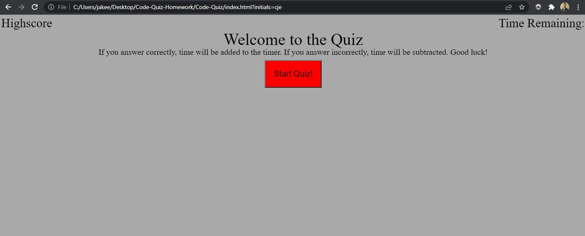

# Code-Quiz

This was by far the most challenging exercise I have had to do thus far in the boot camp. This code quiz incorporated all three languages we have learned so far, with a majority of the heavy lifting being done by javascript. In the code you will find multiple variables with many functions and event listeners. The JavaScript in particular is very poorly organized but I am too worried about messing anything up at this point to move anything around.

# Functionality

The quiz functions as it should through the questions and into the submit form. The functions provided will carry the user through each question making for a user friendly experience. The timer begins when the user clicks the start button and it will end the quiz if the user runs out of time. I could not figure out how to get it to stop counting though. It will go into negative numbers. I struggled heavily trying to figure out how to store user initials and scores in local storage and getting it to render back on the page for the user to see. At this point in time, I am in over ten hours on it today alone so I am going to bite that bullet on that portion. I am happy with the way everything else turned out though. It is definitely not the prettiest code/site I have ever seen, but it functions (besides what I just talked about).

# Screenshot

# Link to Deployed Application

https://jakeeis24.github.io/Code-Quiz/
